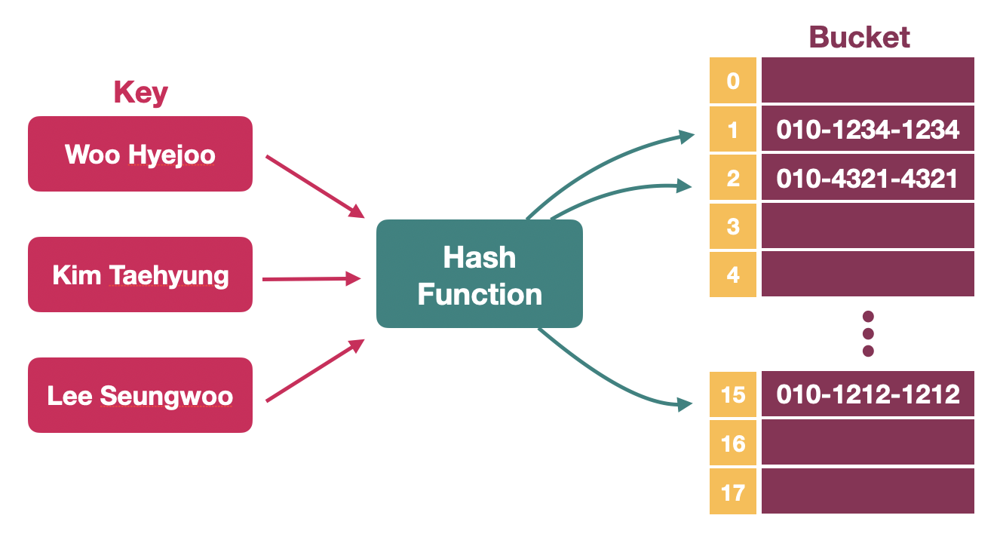
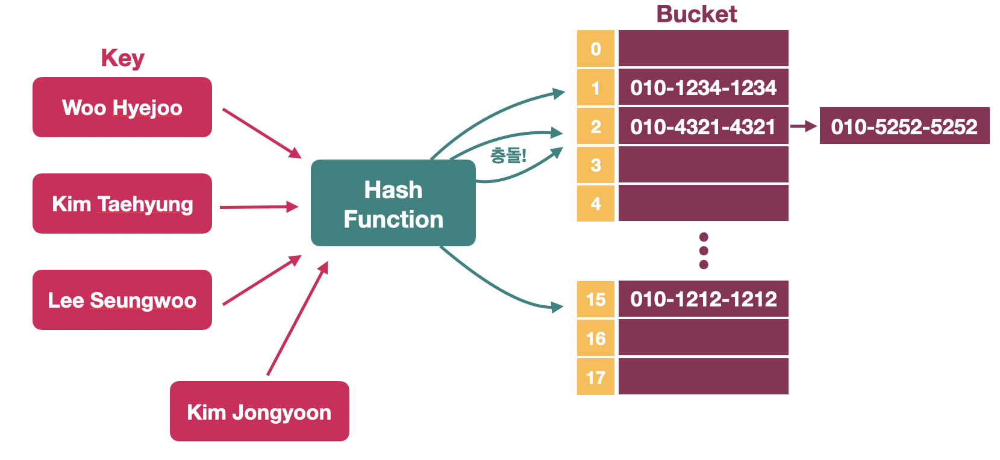
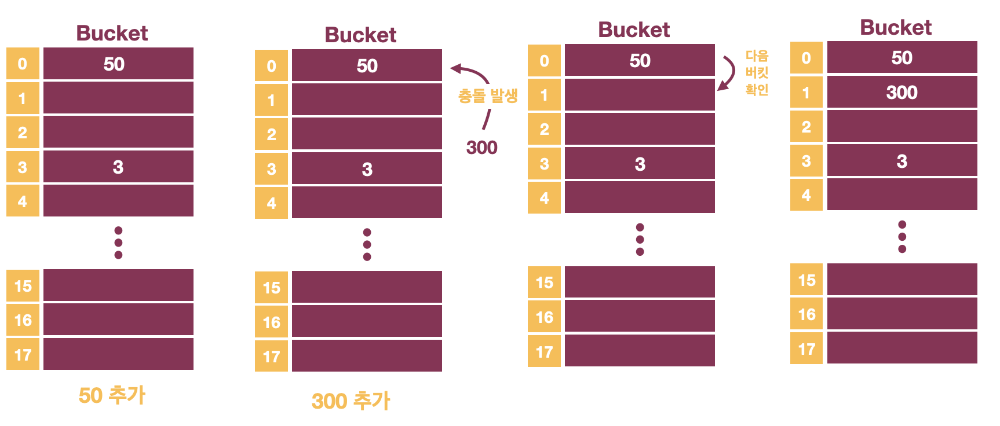
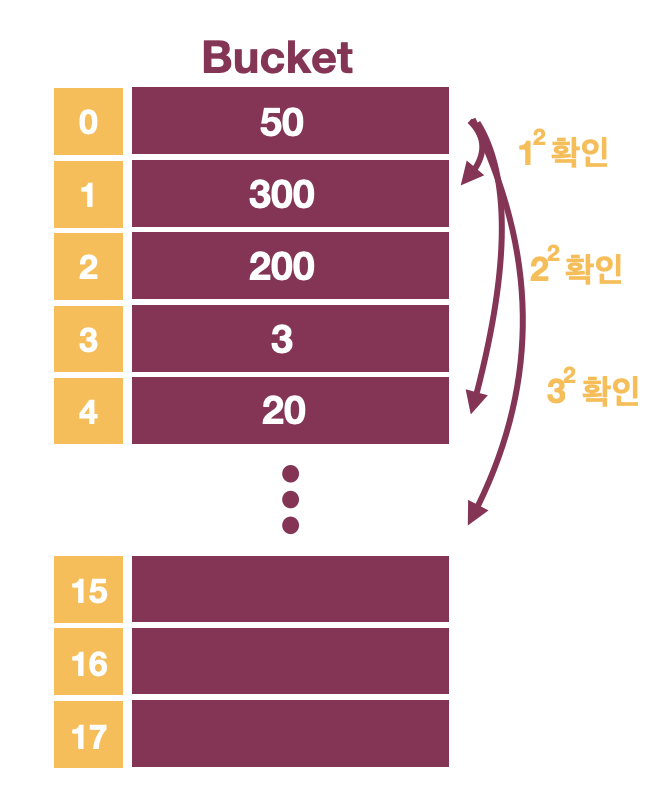

## 해시 테이블(Hash Table)


### 해시 테이블이란?

해시함수를 이용하여 Key 값을 해시 값과 매핑시키고 이를 인덱스로 하여 데이터를 저장하는 자료구조이다.  
이 때 데이터가 저장되는 공간을 버킷(Bucket) 혹은 슬롯(Slot)이라고 한다.

<p align="center"></p>


### 왜 사용하는가?

* 적은 리소스로 많은 데이터를 효율적으로 관리가 가능하다.
* 해시 값을 사용하여 데이터를 저장하므로 검색, 삽입/삭제가 빠르다.


### Hash Function

해시 함수는 데이터를 효율적으로 관리하는 목적으로 키 값을 고정된 길이의 데이터로 맵핑을 해주는 함수로 매핑하는 과정을 **해싱(Hashing)**이라고 한다.  
고정된 길이의 데이터에 맵핑을 하기 때문에 서로 다른 키가 동일한 해시 값으로 맵핑 될 수 있는데 이를 **해시 충돌(collision)**이 발생했다고 한다.  
이를 줄이기 위해 해시 함수를 설계할 때 해시 값을 고르게 만들어야 하는데 몇가지 방법이 존재한다.

* **Division method**

  나눗셈법은 간단하면서 빠른 연산이 가능한 해시 함수이다.   
  숫자로 된 키를 테이블 크기(N)로 나눈 나머지 값이 해시 값이 된다.  
  이 때 테이블 크기를 소수로 많이 사용하며 2의 제곱수와 거리가 먼 것이 좋다.

* **Multiplication method**

  곱셈법은 다음과 같은 방법으로 해시 값을 도출한다.

  ```javascript
  fun(k) = (kA % 1) * m		// A는 0과 1 사이의 실수
  ```

  여기서 m이 무엇이든 크게 중요하지 않으며 보통은 2의 제곱수로 정한다.  
  나눗셈법보다는 느리지만, 2진수 연산에 최적화한 컴퓨터 구조를 고려한 해시 함수이다.

* **Universal hashing**

  다수의 해시 함수를 만들고 이 집합에서 무작위로 선택하여 해시 값을 도출해내는 방식을 말한다.  


### 충돌 방지 방법

#### # Chaining

한 버킷에 하나의 데이터만 저장하는 것이 아니라 `Linked List` 혹은 `Red-Black Tree`를 사용하여 데이터를 묶는다.  
충돌을 회피 할 수 는 있지만 충돌이 많이 일어날 경우 계속해서 데이터를 연결하므로 검색, 삽입/삭제 속도의 장점이 사라지며, 추가적인 메모리가 필요하다는 단점이 생긴다.

<p align="center"></p>

#### # Open addressing

Chaining 방법과는 다르게 추가적인 메모리 공간을 사용하지 않고 빈 버킷을 찾는 방식이다.  
버킷을 확인하는 방법은 여러개가 존재하는데 가장 간단한 방법은 선형 탐사 방법이다.

* **Linear Probing(선형 탐사)**

  선형 탐사 방법은 가장 간단한 방식으로 충돌이 발생한 공간에서 바로 다음 공간을 확인한다.
  
  <p></p>
  
  여기에 200을 추가한다면 0번 인덱스 버킷을 확인하고 존재하므로 1번, 2번 버킷을 확인한 뒤에 저장이 되는 방식이다.  
  0부터 5번째 버킷이 모두 채워져 있다면 6번을 확인하고 데이터를 채워 넣을 수 있다.
  
* **Quadratic probing(제곱 탐사)**

  선형 탐사의 비효율 적인 탐사 방법을 어느정도 해결하기 위해 바로 다음 버킷을 탐사하는 것이 아닌 제곱만큼 떨어진 공간을 탐사하는 방법이다.

  <p></p>

* **Double hashing(이중 해싱)**

  2개의 해시 함수를 사용하여 충돌을 회피하는 방법이다.  
  하나의 함수는 해시 값을 얻을 때 사용하며 나머지 함수는 충돌이 일어날 시 이동 폭을 얻기 위해 사용한다.


### 해시 버킷 동적 확장(Resize)

버킷의 수가 적다면 메모리를 아낄 수 있지만 충돌이 날 가능성이 굉장히 높아져 성능이 떨어진다.  
그렇기에 일정 개수 이상(보통 전체의 75%)이 된다면 버킷의 수를 두배로 늘린다.  

