## Heap

### 힙(Heap) 이란?

완전 이진 트리(Complete Binary Tree)의 일종으로 **우선순위 큐**에서 사용되는 자료구조이다.  

* 우선순위 큐

  > Queue에 우선순위 개념을 도입한 자료구조로 데이터 마다 우선순위를 가지고 있다.  
  > 우선순위 큐에서는 우선순위가 높은 데이터가 먼저 빠져나간다.

즉, 여러 개의 데이터 중에서 최댓값 혹은 최솟값을 빠르게 찾을 수 있도록 설계되었다.

### 특징

* 일종의 **반정렬 상태(느슨한 정렬 상태)**를 유지

  느슨한 정렬이란, 모든 수를 완벽하게 정렬하지 않음을 의미한다.  
  힙에서는 큰 값이 상위 레벨에 작은 값은 하위 레벨에 존재하므로 느슨한 정렬 상태를 가지고 있다.
  (부모와 자식 사이에만 정렬, 자식들 사이의 정렬은 상관 X)

* 중복된 데이터를 허용

  이진 탐색 트리에서는 중복된 값을 허용하지 않지만, 힙에서는 중복된 값을 허용한다.

* 삽입과 삭제시 `O(log n)`의 시간을 가짐

  완전 이진 트리이므로 n개의 노드를 가졌을 때 최대 깊이는 `log n`이 된다.  
  삽입과 삭제시에 부모 노드와 자식 노드의 비교를 최대 깊이까지 하기 때문에  `O(log n)`의 시간을 가지게 된다.

### 종류

#### 최대 힙(Max Heap)

> 부모 노드의 값이 자식 노드의 값보다 크거나 같은 완전 이진 트리

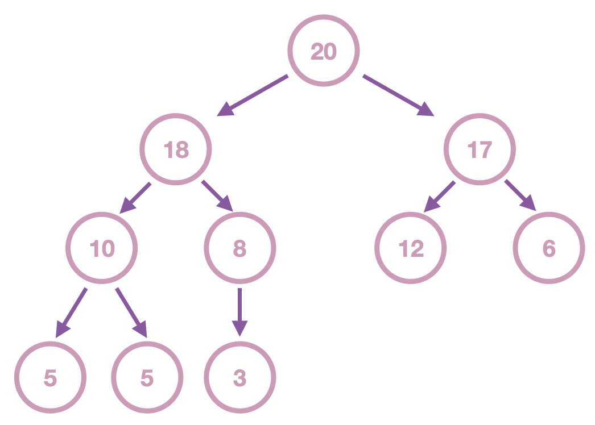

#### 최소 힙(Min Heap)

> 부모 노드의 값이 자식 노드의 값보다 작거나 같은 완전 이진 트리

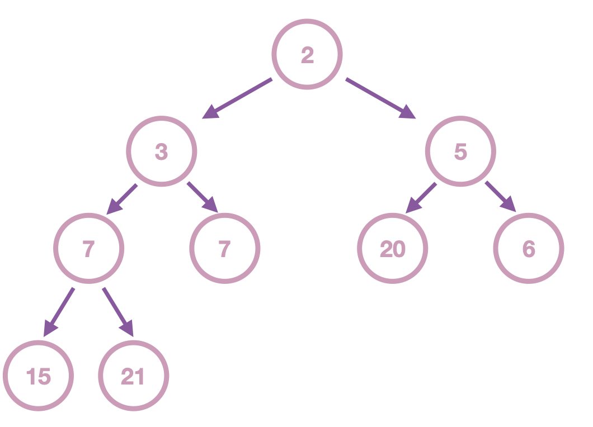

### 구현

힙을 구현하기 위해 가장 많이 사용되는 자료구조는 **배열(Array)**이다.  
이 때, 구현을 쉽게 하기 위해 0번째 인덱스는 사용하지 않고 1번 인덱스부터 사용한다.(루트 노드는 항상 1번째 값)  
부모 노드가 `n`번째 데이터라면 자식 노드는 `2*n`번째와 `2*n + 1`번째 데이터다.

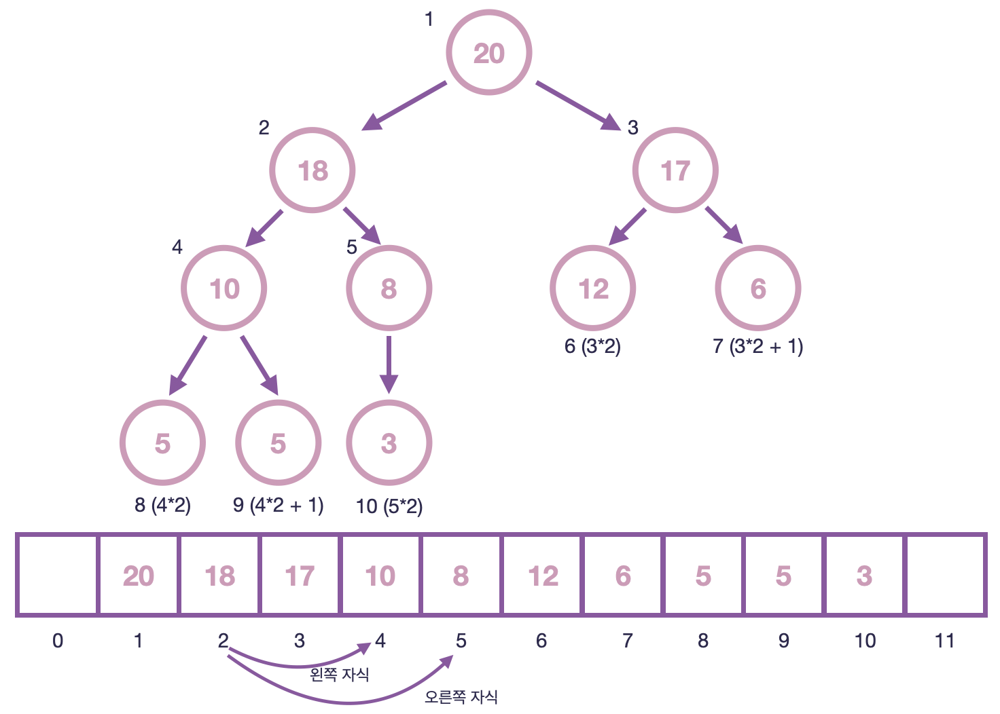

### 삽입시

힙에 새로운 값이 들어오면 배열의 맨 마지막에 삽입된다.  
이후 부모의 값과 비교하며 자신의 자리를 찾는다.

* 19 삽입

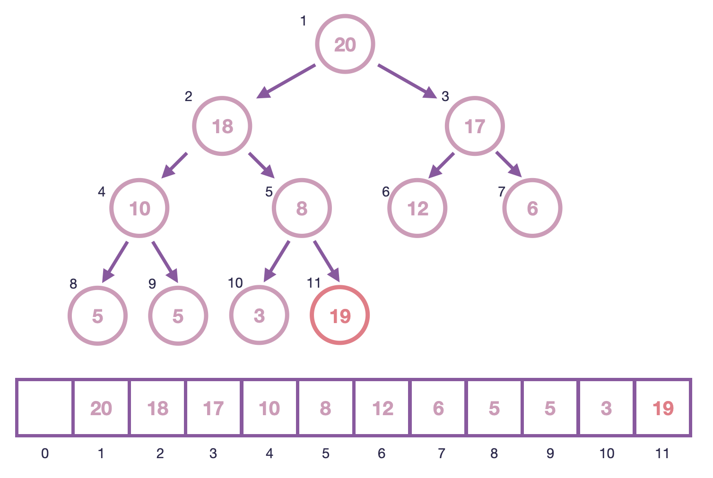

* 부모 노드인 8(5번째 값)과 비교하여 자식 노드의 값이 더 크므로 교환

  
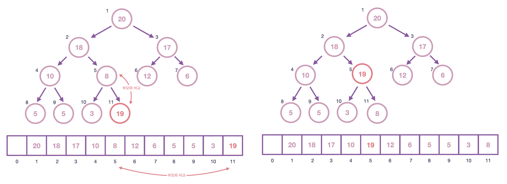

* 부모 노드인 18(2번째 값)과 비교하여 자식 노드의 값이 더 크므로 교환

  
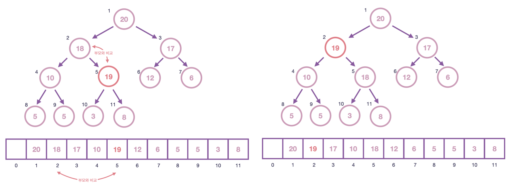

* 부모 노드인 20(1번째 값)과 비교하여 부모 노드 값이 더 크므로 Stop

  
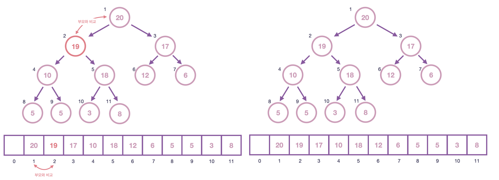

### 삭제시

삭제시에는 루트 노드가 빠져나가게 되고 가장 마지막 노드를 루트 노드로 변경한다.  
이후 자식들 중에서 더 큰 노드와 계속해서 비교하며 자리를 찾는다.

* 삭제

  

  
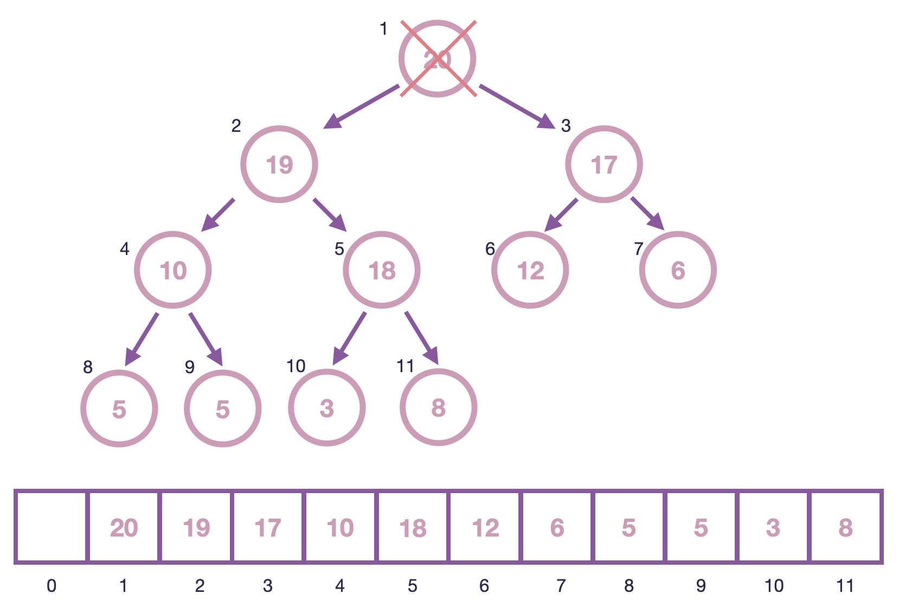

* 마지막 노드를 루트 노드로 변경

  
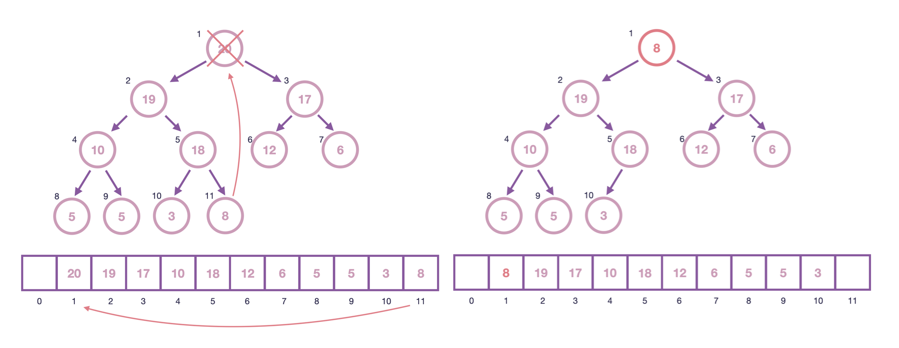

* 자식들 중에서 더 큰 자식 노드(19, 2번째 노드)과 비교하여 자식 노드가 더 크므로 교환

  
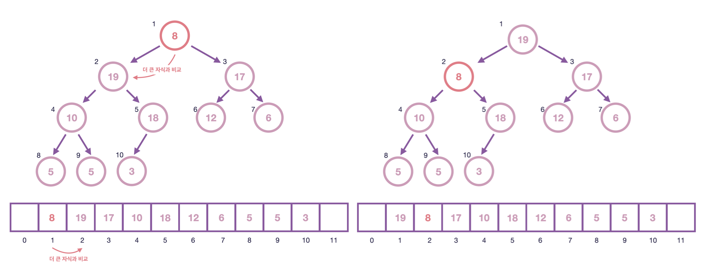

* 자식들 중에서 더 큰 자식 노드(18, 5번째 노드)과 비교하여 자식 노드가 더 크므로 교환

  
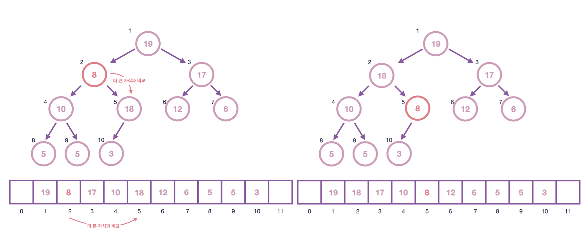

* 자식들 중에서 더 큰 자식 노드(3, 10번째 노드)과 비교하여 자식 노드가 작으므로 Stop

  
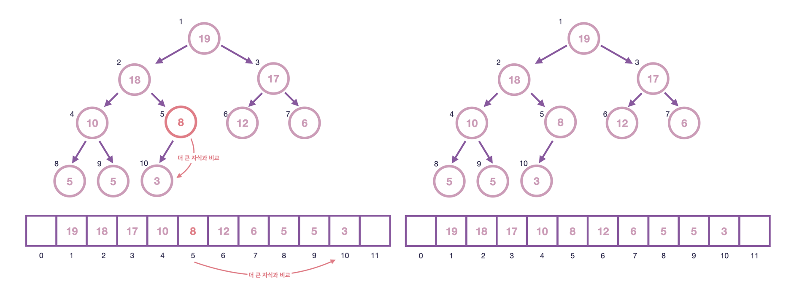

