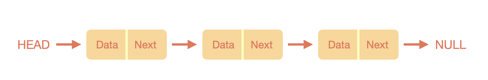
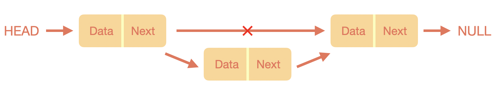
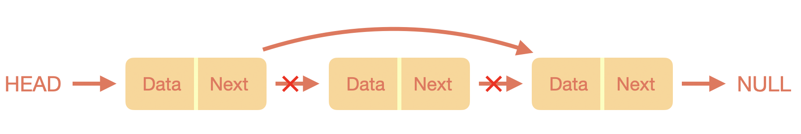
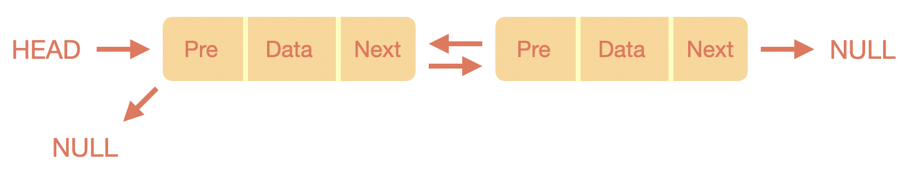
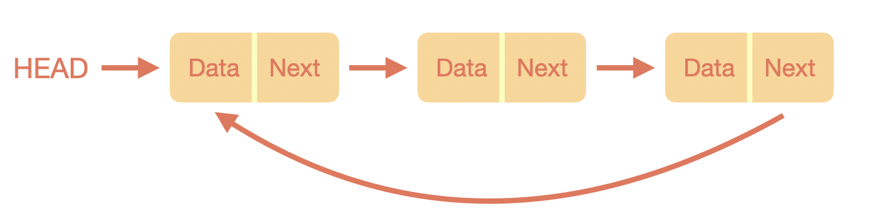

## Linked List(연결 리스트)

### Linked List란?

배열에서 몇 개의 단점들이 존재했는데 이를 해결하기 위해 나온 자료구조가 바로 **Linked List**다.  
이름 그대로 데이터가 연결되어 있는 형태지만, 실제 메모리에서는 연속적인 위치에 저장되어 있지 않다.  
따라서 하나의 노드에서는 다음 노드에 대한 참조를 포함하고 있다.

### 특징

* 다음 노드를 가리키는 포인터를 가지고 있기 때문에 삽입과 삭제시에 `O(1)` 시간이 걸린다.
  삭제할 노드의 이전 노드의 참조를 삭제할 노드의 다음 노드로 변경하기만 하면 된다.

  * 노드 삽입

    

  * 노드 삭제

    

* 원하는 데이터를 찾기 위해서는 처음 위치부터 차근차근 살펴보아야 한다.
  배열과는 다르게 메모리에 연속적이지 않기 때문에 Random access를 할 수 없다.
  즉, 원하는 데이터가 맨 마지막에 위치한다면 `O(n)` 시간이 걸리게 된다.

* 데이터가 연속적이지 않기 때문에 크기는 마음대로 조절할 수 있다.

* `Tree` 라는 자료구조의 근간이 되는 자료구조이다.

### 왜 사용하는가?

* 데이터를 저장함에 있어 전체적인 크기를 알지 못할 때 용이하게 사용할 수 있다.
* 삭제와 삽입이 많은 상황에서 적절하다.

### 종류

#### 단순 연결 리스트

앞서 설명한 연결 리스트가 바로 **단순 연결 리스트**로 각 노드에는 데이터를 저장하는 공간과 다른 노드를 가르킬 하나의 포인터 공간이 존재한다.

#### 이중 연결 리스트

단순 연결 리스트와 구조는 동일하나 포인터 공간이 두개가 존재한다.  
하나의 포인터는 다음 노드를 가리키고 나머지 포인터는 이전 노드를 가리킨다.  
앞, 뒤 포인터가 존재하므로 단순 연결 리스트에 비해 탐색이 조금 더 자유롭지만, 변수를 하나 더 사용하므로 메모리 사용량이 더 커지고 구현이 복잡해지는 단점도 존재한다.

#### 원형 연결 리스트

단순 연결 리스트에서 마지막 노드가 `null` 을 가리키는 것이 아니라 맨 앞 노드를 가리키게 하여 원형 구조를 가진 연결 리스트이다.